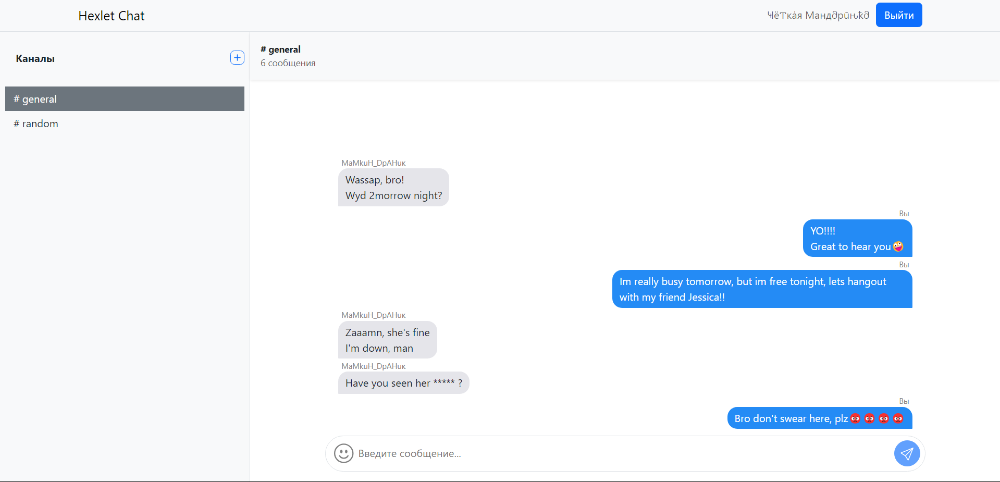
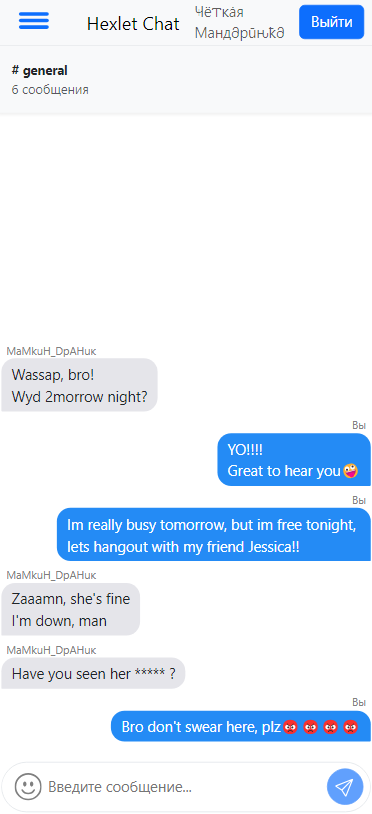

# Hexlet Chat

[](https://github.com/mkh1n/frontend-project-12/actions)
[](https://codeclimate.com/github/mkh1n/frontend-project-12/maintainability)

Hexlet Chat is a simplified version of Slack that allows users to write, delete, and edit messages, as well as create, delete, and rename channels. You can register and log in to the site with different user accounts. The site is responsive and has a mobile version. Additionally, you can select emojis for input. 

This repository is a learning project for the Hexlet educational platform.

## Technologies

The project uses the following technologies:

- **React**: A library for building user interfaces.
- **Bootstrap**: A framework for creating responsive and mobile-first web applications.
- **Socket.io**: A library for implementing web sockets.
- **i18next**: A library for internationalization and localization.
- **Censorship** - Every swear word is censored using a special library.
- **@hexlet/chat-server**: The server-side part of the chat.

## Demonstration

To try out the chat, you can visit the site: [Hexlet Chat](https://frontend-project-12-806g.onrender.com/)

## Installation and Setup

### Local Installation

1. **Clone the repository or download the archive**:

   ```sh
   git clone https://github.com/your-username/hexlet-chat.git
   cd hexlet-chat
   ```
   
2. **Install dependencies:**

   ```sh
   make install
   ```
   
3. **Build the React project:**

   ```sh
   make build
   ```
   
4. **Start the @hexlet/chat-server:**

   ```sh
   make start
   ```
   
5. **Open your browser and go to:**

   ```sh
   http://localhost:5001/
   ```	
   Now the chat should be running locally on your computer.

## Features
- **Registration and Login:** Users can register and log in to the site with different accounts.
- **Messages:** Users can write, delete, and edit messages.
- **Channels:** Users can create, delete, and rename channels.
- **Emojis:** Ability to select emojis for input.
- **Responsiveness:** The site is responsive and has a mobile version.




  
